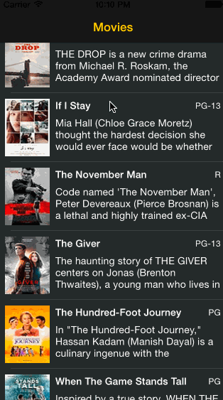

# RottenTomatoes Box Office Demo

This is an iOS demo application for displaying the latest box office movies using the [RottenTomatoes API](http://www.rottentomatoes.com/).

Time spent: 7 hours spent in total

Completed user stories:

* [x] User can view a list of movies from Rotten Tomatoes. Poster images must be loading asynchronously.
* [x] User can view movie details by tapping on a cell
* [x] User sees loading state while waiting for movies API. Used [MBProgressHUD](https://github.com/jdg/MBProgressHUD).
* [x] User sees error message when there's a networking error. Used [ALAlertBanner](https://github.com/alobi/ALAlertBanner).
* [x] User can pull to refresh the movie list.
* [x] Optional: Customize the navigation bar.
* [x] Optional: All images should be cached in memory and disk.
 
Notes:

Spent extra time on the movie details page to the autosize synopsis text label and get scrolling working with a `UIScrollView`.

Walkthrough of all user stories:

